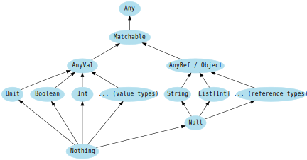

# 首次观察类型

Scala 中，所有的值都有类型，数值型值与函数同样如此。下图展示了类型继承的关系：



## Scala 类型继承

`Any` 是所有类型的超级类型，也被称为**顶层类型**。它定义了一些通用的方法，例如 `equals`，`hashCode` 以及 `toString`。

`Any` 有一个子类型名为 `Matchable`，它用于标记所有类型使我们可以进行类型匹配。保证一个名为“parametricity”的属性至关重要。这里不深入展开，总结一下就是我们不可以对 `Any` 进行模式匹配，而是只能对其子类型 `Matchable` 进行模式匹配。

`Matchable` 有两个重要的子类型：`AnyVal` 以及 `AnyRef`。

`AnyVal` 代表值类型，其包含一些预定义的值类型，且它们都是非空的：`Double`，`Float`，`Long`，`Int`，`Short`，`Byte`，`Unit` 和 `Boolean`。`Unit` 是一个携带了无意义信息的值类型。`Unit` 仅有的实例我们可以应用为 `()`。

`AnyRef` 代表引用类型。所有的非值类型都被定义为引用类型。所有在 Scala 中定义的类型都是 `AnyRef` 的子类型。如果 Scala 是被运行在 Java 的运行环境，那么 `AnyRef` 相当于 `java.lang.Object`。

在基于声明的语言中，`void` 用作于没有任何返回的方法。Scala 则使用 `Unit` 作为相同目的：

```scala
def pintIt(a: Any): Unit = println(a)
```

下面的例子展示了字符串，整数，字符，布尔值，以及函数，它们皆为 `Any` 的实例，并可以被视为对象：

```scala
val list: List[Any] = List(
  "a string",
  732,  // an integer
  'c',  // a character
  true, // a boolean value
  () => "an anonymous function returning a string"
)

list.foreach(element => println(element))
```

## Scala 的值类型

如上所示，Scala 的数值类型继承与 `Anyval`，它们皆为成熟的对象。下面例子展示如何声明数值类型的变量：

```scala
val b: Byte = 1
val i: Int = 1
val l: Long = 1
val s: Short = 1
val d: Double = 2.0
val f: Float = 3.0
```

前四个声明中，如果不显式的声明类型，`1` 会被默认为 `Int`，因此如果你需要别的数据类型 -- `Byte`，`Long`或者`Short` -- 你需要显式的声明它们。带有小数点的数字（例如 2.0）则会被默认为 `Double`，因此当你需要一个 `Float` 时，也需要显式的声明。

在代码中你可以在数字后面添加 `L`，`D` 以及 `F` 字符（小写也可以）来指定它们为 `Long`，`Double` 和 `Float`：

```scala
val x = 1_000L   // val x: Long = 1000
val y = 2.2D     // val y: Double = 2.2
val z = 3.3F     // val z: Float = 3.3
```

Scala 也有 `String` 和 `Char` 类型，可以隐式的声明它们：

```scala
val s = "Bill"
val c = 'a'
```

以上的数据类型的范围值如下：

| Data Type | Possible Values                                                                              |
| --------- | -------------------------------------------------------------------------------------------- |
| Boolean   | true or false                                                                                |
| Byte      | 8-bit signed two’s complement integer (-2^7 to 2^7-1, inclusive) -128 to 127                 |
| Short     | 16-bit signed two’s complement integer (-2^15 to 2^15-1, inclusive) -32,768 to 32,767        |
| Int       | 32-bit two’s complement integer (-2^31 to 2^31-1, inclusive) -2,147,483,648 to 2,147,483,647 |
| Long      | 64-bit two’s complement integer (-2^63 to 2^63-1, inclusive) (-2^63 to 2^63-1, inclusive)    |
| Float     | 32-bit IEEE 754 single-precision float 1.40129846432481707e-45 to 3.40282346638528860e+38    |
| Double    | 64-bit IEEE 754 double-precision float 4.94065645841246544e-324 to 1.79769313486231570e+308  |
| Char      | 16-bit unsigned Unicode character (0 to 2^16-1, inclusive) 0 to 65,535                       |
| String    | a sequence of Char                                                                           |

## `BinInt` 与 `BigDecimal`

当你需要大数字是，可以使用 `BigInt` 和 `BigDecimal`：

```scala
val a = BigInt(1_234_567_890_987_654_321L)
val b = BigDecimal(123_456.789)
```

`Double` 和 `Float` 都是近似的小数数值，而 `BigDecimal` 是用于精确计算的，例如货币计算。

`BinInt` 与 `BigDecimal` 最大的好处是它们也享有普通的数值类型的计算：

```scala
val b = BigInt(1234567890)   // scala.math.BigInt = 1234567890
val c = b + b                // scala.math.BigInt = 2469135780
val d = b * b                // scala.math.BigInt = 1524157875019052100
```

## 关于字符串的两点注意事项

Scala 的字符串类似于 Java 的字符串，但是它们有额外的两个特性：

- 它们支持字符串插值
- 可以轻松的创建多行字符串

## 类型转换

值类型可以如下转换：


例如：

```scala
val x: Long = 987654321
val y: Float = x  // 9.8765434E8 (note that some precision is lost in this case)

val face: Char = '☺'
val number: Int = face  // 9786
```

## `Nothing` 与 `null`

`Nothing` 是所有类型的子类型，也被称为**底类型**。其常见的用途是表示未终止，如抛出异常、程序退出或无限循环 -- 也就是说，它是表达式的类型，其计算结果不为值，或方法不能正常返回。

`Null` 是所有引用类型的子类型（即任何 `AnyRef` 的子类型）。它拥有一个单值标记为 `null`。当前使用 `null` 是被视为坏的做法。
